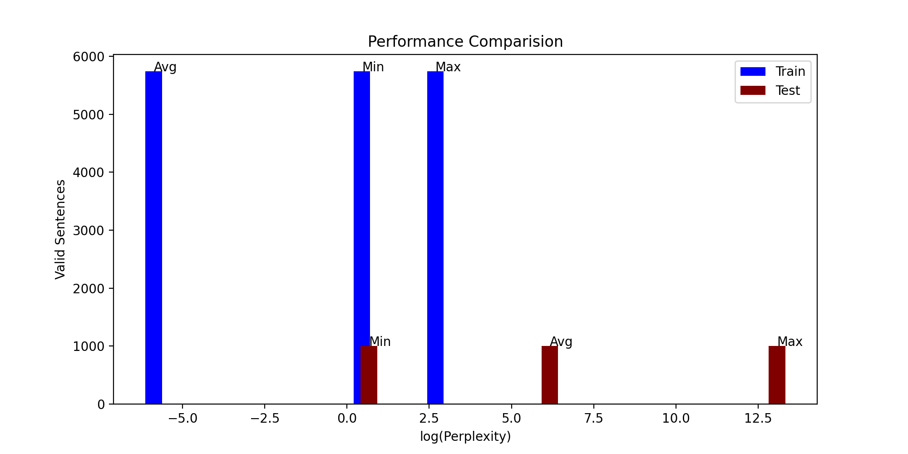
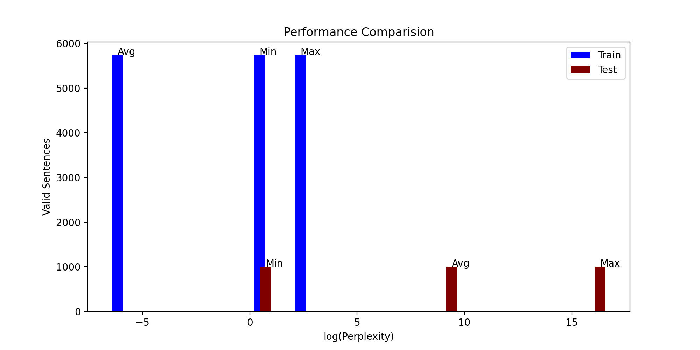
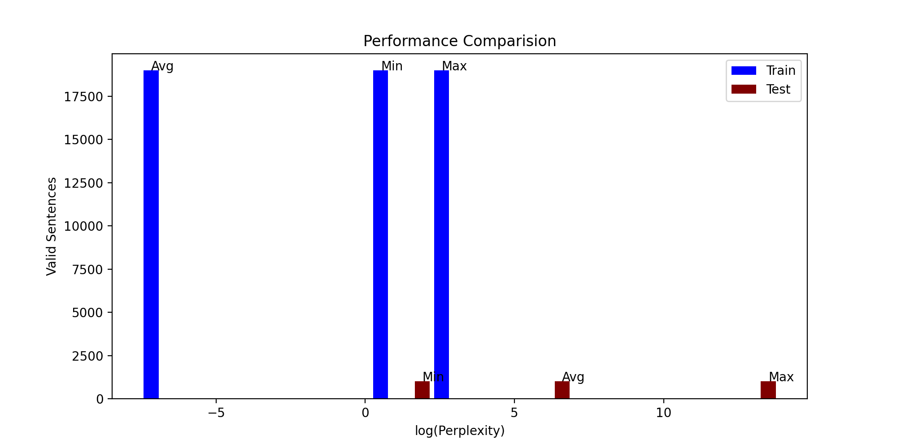
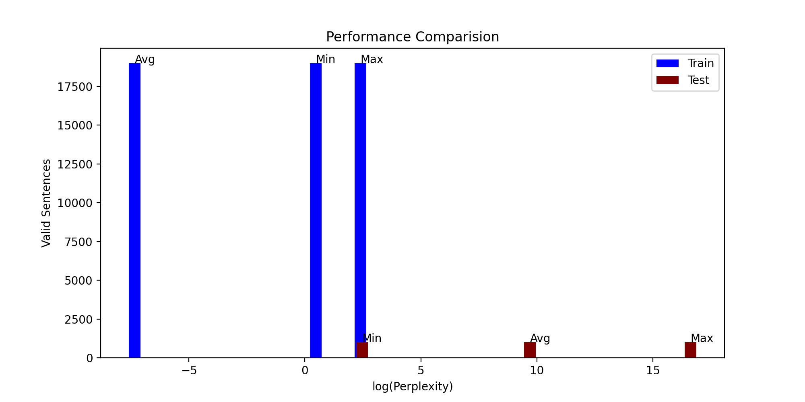

# Statistical Language Model

## Tokenization

Cleaning, tokenizing and padding of data done. We first clean the data - replace all hastags, urls and mentions with their respective tags and delete repeating sequence of special characters in `clean_data`. For the later part, we are required to pad the sentences to deal with n-grams. This is done in `add_buffer`. `dense_clean` replaces very short filler words, unkown sequences, and highly improbable words with a tag. This is all handld by the class `Tokeniser`.

## Smoothing

Prior to performing smoothing, we require to compute the frequency of n-grams in the dataset. We do this by creating a dictionary of dictionaries for each n-gram that contains a key (n-1 gram) whose value is the word itself and the word being the key to another dictionary whose value is the frequency of occurence of the n-gram. This is handled by `create_ngram_dictionary`. All functions under this are members of the class `Functions`.

### Kneser Ney

We need to compute the probabilities of 1-grams, 2-grams ... till the n-gram. We have three terms to compute - the first term, lambda, and the continuous probability which depends on the lower grams.

The function `kneser_ney` is recursive and calls upon itself until the 1-gram whose probability is computed by `simple_smoothing`. In case the key doesn't exist in the dictionary (occurs when testing) then we return a very small probability.

### Witten Bell

We need to compute the probabilities of 1-grams, 2-grams ... till the n-gram. The function `witten_bell` is recursive and calls upon itself until the 1-gram whose probability is computed by `simple_smoothing`. In case the key doesn't exist in the dictionary (occurs when testing) then we return a very small probability.

## Testing Metric

We use perplexity to gauge the performance of the model. Lower the perplexity the better the performance. In the following graphs we computed the log of perplexity since the maximum perplexity was significantly larger than the average. This was done merely for simpler reading of the graphs.

Graphs can be found in `./graphs` and results can be found in `./results`.

Kneser Ney on the Europal dataset   

Witten Bell on the Europal dataset      

Kneser Ney on the Medical Abstracts dataset    

Witten Bell on the Medical Abstracts dataset    

